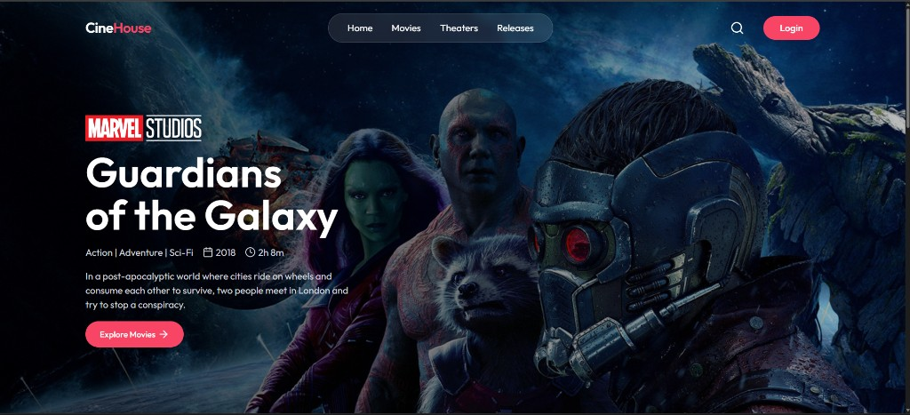

# CineHouse

I built CineHouse as a movie ticket booking app. The idea is simple: pick a film, choose a showtime, sit down with a seat map, and pay before the tickets are yours.

This is a full-stack project. The UI is React. The API is Express. Bookings, shows, and users live in MongoDB. Login is handled by Clerk, payments go through Stripe, and emails / delayed jobs run on Inngest.



The homepage is the first thing a visitor sees. From here they can sign in, open the movie list, and start booking.

## What a user actually does

1. **Looks at movies that have upcoming shows.** The home and movies pages are not a generic TMDB dump. They come from shows that an admin has already added.
2. **Opens a movie.** They see poster, overview, cast, rating, and the dates that still have showtimes.
3. **Picks a date and a time.** That takes them to a seat layout (rows A–J). Already taken seats come from the API and are greyed out.
4. **Selects seats and checks out.** The client sends the show id and seat ids to the backend. The API holds those seats, creates a Stripe Checkout session, and sends the user to Stripe.
5. **Pays.** When Stripe confirms payment, a webhook marks the booking as paid and a confirmation email goes out.
6. **Comes back to My Bookings.** Paid tickets show up there. If they left without paying, they still have a “Pay Now” link until the hold expires.

If someone logs in but never pays, those seats are not meant to stay locked forever. Ten minutes later an Inngest job checks the booking. If it is still unpaid, the seats are freed and the booking is deleted.

People can also heart a movie. Favorites are stored on the Clerk user, then loaded back as movie cards.

## What an admin actually does

Admin lives at `/admin`. Clerk `privateMetadata.role` has to be `"admin"` or the API refuses the request.

From there an admin can:

- Pull currently playing titles from TMDB
- Add showtimes (date, time, ticket price)
- See upcoming shows and how many seats are occupied
- See all bookings
- See a small dashboard: paid booking count, revenue, active shows, user count

When a movie is added for the first time, the server fetches TMDB details and credits, saves the movie in MongoDB, then inserts the show rows.

## How the backend is put together

```text
client/     React + Vite (Clerk login, seat UI, admin screens)
server/     Express API
  routes/        show, booking, user, admin
  controllers/   the actual booking / payment / TMDB logic
  models/        User, Movie, Show, Booking
  middleware/    admin role check
  inngest/       user sync, payment timeout, emails
```

A booking is a document with the Clerk user id, the show, seat list, amount, `isPaid`, and a Stripe payment link. A show stores `occupiedSeats` as an object like `{ "A1": "user_123" }`. That is how the app knows a chair is taken, including seats that are only held until payment.

Clerk users are copied into MongoDB when Clerk fires `user.created` / `updated` / `deleted` through Inngest, so bookings can point at a local user record for emails.

## What I used

- **React, Vite, Tailwind** for the client
- **Express** for REST APIs
- **MongoDB + Mongoose** for movies, shows, bookings, users
- **Clerk** for sign up, login, and the admin role
- **Stripe Checkout** plus a signed webhook to mark bookings paid
- **TMDB** for now-playing titles, posters, and movie details
- **Inngest** for the 10-minute unpaid-seat release, confirmation mail, and user sync
- **Nodemailer / Brevo** to send the emails

## Run it locally

Two terminals. Start the server first.

**API**

```bash
cd server
npm install
npm run server
```

Needs a `server/.env` with MongoDB, Clerk, TMDB, Stripe, Inngest, and SMTP keys. The API listens on `http://localhost:3000`.

**Client**

```bash
cd client
npm install
npm run dev
```

Needs a `client/.env`:

```env
VITE_CURRENCY=$
VITE_BASE_URL=http://localhost:3000
VITE_TMDB_IMAGE_BASE_URL=https://image.tmdb.org/t/p/original
VITE_CLERK_PUBLISHABLE_KEY=
```

Vite is usually at `http://localhost:5173`.

To open `/admin`, set that Clerk user’s private metadata to `{ "role": "admin" }`.

## Honest notes

Seat holds are a read-then-write on the show document. Two people clicking the same seat at the same time are not locked with a Mongo transaction. I would tighten that with a conditional update if I took this further.

Reminder emails are wired on an 8-hour cron, but they query a `showTime` field the Show model does not have, so those reminders do not fire correctly yet. Confirmation mail after a successful payment does.

Inngest has to be synced (local or hosted) or the delayed jobs and Clerk user sync will not run.
